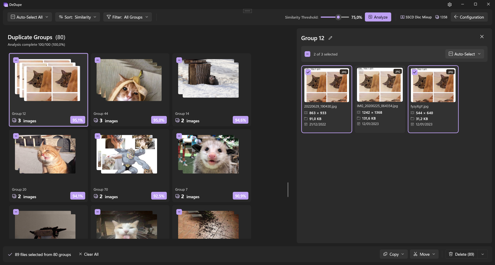
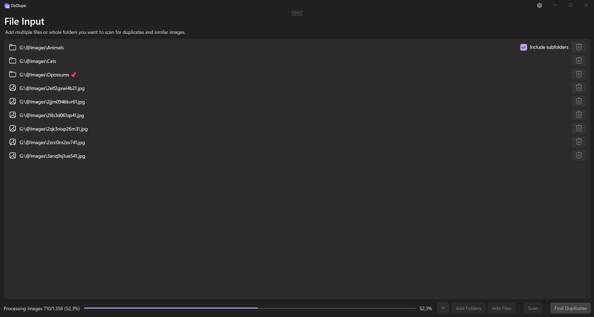
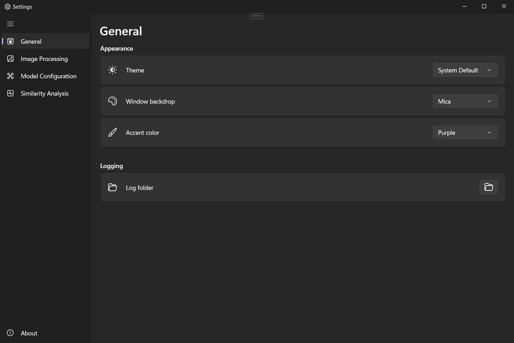

#  DeDupe

DeDupe is a simple application for finding and managing duplicate and visually similar images using deep learning.

Just enter your image sources (folder or files) and DeDupe will scan them, extract features using a pre-trained model, and group similar images together. 
You can then review and manage the groups by removing duplicates or moving similar images into separate folders.



Built with WinUI 3, .NET 10, and ONNX Runtime with DirectML.

The bundled SSCD (Self-Supervised Copy Detection) model was developed by Meta AI Research and is specifically designed for image copy detection.

## Features

- **Visual grouping** - Automatically groups similar images for comparison side by side.
- **Auto-Selection** - Automatically select duplicates based on criteria like lowest resolution, oldest file, etc.
- **Batch management** - Select and delete or move images in bulk.
- **Deep learning similarity detection** - Uses a pre-trained ONNX model to extract features and find visually similar images, even if they have been cropped or resized.
- **GPU-accelerated processing** - Uses DirectML to leverage your GPU for fast feature extraction. NVIDIA, AMD, and Intel GPUs are supported. (Optional)
- **Use your own model** - Easily use and configure your own ONNX model for feature extraction. DeDupe is designed to be model-agnostic.
- **Adjust similarity threshold** - Fine-tune the sensitivity of the duplicate detection and grouping.
- **No configuration required** - Just select the image sources and start scanning. The included model is ready to use out of the box.
- **Local & private** - All processing happens locally and offline on your machine. No images are uploaded anywhere.

## Requirements

- Windows 10 version 1809 (build 17763) or later / Windows 11
- Sufficient free disk space for temporary processing files

## Installation

> [!WARNING]
> This application is still in early development. Use at your own risk.

### Microsoft Store (Recommended)

The easiest way to install DeDupe is through the Microsoft Store.

[](https://apps.microsoft.com/)

### GitHub Release (Sideload)

Download the `.msix` for your architecture (x64, x86, or ARM64) from the [Releases](../../releases) page.

Since the GitHub release is signed with a self-signed certificate, Windows will not install it by default. You have two options:

<details>
<summary><b>Option 1: Install the certificate (Recommended)</b></summary>

1. Download `DeDupe.cer` from the release assets.
2. Double-click the `.cer` file → **Install Certificate**.
3. Select **Local Machine** → **Place all certificates in the following store** → Browse → **Trusted People** → OK.
4. Complete the wizard, then double-click the `.msix` to install.

</details>

<details>
<summary><b>Option 2: Enable Developer Mode</b></summary>

1. Open **Settings** → **For developers** (Windows 11) or **Update & Security** → **For developers** (Windows 10).
2. Enable **Developer Mode**.
3. Double-click the `.msix` to install.

> [!NOTE]
> Developer Mode loosens some security restrictions on your system. Only enable this if you understand what you're doing.

</details>

## Usage

1. **Add Images** - Add images or folders containing images by using the buttons or drag-and-drop.
2. **Process** - Click the "Scan" button to start processing the files and extracting features. This may take some time depending on the number of images and your hardware.
3. **Find Duplicates** - Once the Scan is complete, you can navigate to the next page by pressing the "Find Duplicates" button. Here you can review the groups of similar images.
4. **Analyze Similarities** - When entering the page, DeDupe will automatically analyze the similarities. This can also take some time. After this, it will display all the grouped images. You can adjust the similarity threshold and re-analyze.
5. **Manage Duplicates** - Use the auto-select checkboxes to select automatically images with specific criteria. You can also manually select or deselect images.
6. **Delete or Move** - Once you have selected the images you want to manage, you can either delete them or move them to a different folder using the buttons at the bottom.



## Configuration

- **Appearance** - Change theme, accent color and backdrop.
- **Performance** - GPU Acceleration, batch and parallel processing.
- **Image Processing** - Select temp file output, like filetype and interpolation methods.
- **Border Detection** - Image processing option to remove borders and letterboxes from images before passing them to the model.
- **Model Selection** - Choose between bundled model or use your own and adjust the normalization values.



## Building from Source

**Prerequisites:**
- Windows 10 version 1809 (build 17763) or later
- [.NET 10 SDK](https://dotnet.microsoft.com/download/dotnet/10.0)
    - .NET Desktop Development
    - Windows App SDK (C#)
- [Windows 10/11 SDK](https://developer.microsoft.com/windows/downloads/windows-sdk/) (for packaging)

```bash
git clone https://github.com/Jan-Eric-B/DeDupe.git
cd DeDupe
git lfs install
git lfs pull
dotnet restore src\DeDupe\DeDupe.csproj
dotnet build src\DeDupe\DeDupe.csproj -c Release -p:Platform=x64
```


## Roadmap / Future Plans

- **Video support** - Extend the application to support video files, by extracting a specified amount of frames and processing them as images.
- **FFMPEG integration** - Integration of FFMPEG for expanding image format support.
- **Temp file optimization** - Batch process images in memory and only hold all extracted features there instead of writing temporary files to disk.
- **File handling** - More options to handle duplicate files.
- **Improved UI** - Better design and different views (like list view) for comparing images.
- **Localization** - Support for multiple languages.
- **Extensive metadata** - Display more metadata and allow sorting by it.
- ...

## Contributing

Feel free to contribute to this project!

Especially help with performance optimizations and the overall model usage.
Feature requests would also be great!

## Dependencies

DeDupe is built on the following libraries:

| Library                                                                | License      | Purpose                            |
| ---------------------------------------------------------------------- | ------------ | ---------------------------------- |
| [CommunityToolkit.Mvvm](https://github.com/CommunityToolkit/dotnet)    | MIT          | MVVM architecture                  |
| [CommunityToolkit.WinUI](https://github.com/CommunityToolkit/Windows)  | MIT          | UI controls                        |
| [Microsoft.Extensions.Hosting](https://github.com/dotnet/runtime)      | MIT          | Dependency injection & hosting     |
| [Microsoft.ML.OnnxRuntime](https://github.com/microsoft/onnxruntime)   | MIT          | Neural network inference           |
| [Serilog](https://github.com/serilog/serilog)                          | Apache 2.0   | Logging                            |
| [SixLabors.ImageSharp](https://github.com/SixLabors/ImageSharp)        | Apache 2.0 ¹ | Image preprocessing                |
| [Windows App SDK](https://github.com/microsoft/WindowsAppSDK)          | MIT          | WinUI 3 framework                  |
| [WinUI3Localizer](https://github.com/AndrewKeepCoding/WinUI3Localizer) | MIT          | Localization (vendored & modified) |

¹ ImageSharp is licensed under the [Six Labors Split License](https://github.com/SixLabors/ImageSharp/blob/main/LICENSE). 
It is granted under Apache 2.0 for open source projects.

**Model:** The SSCD model (`sscd_disc_mixup.onnx`) is based on [facebookresearch/sscd-copy-detection](https://github.com/facebookresearch/sscd-copy-detection), licensed under MIT. 
The included ONNX file was converted using [PyTorch](https://pytorch.org/).

## License

DeDupe is licensed under the **GNU General Public License v3.0**. See [LICENSE](LICENSE) for the full text.

This means you are free to use, modify, and distribute this software, provided that any derivative works are also distributed under GPL v3 and the source code is made available.

## Disclaimer

DeDupe is provided "as is", without warranty of any kind. The authors are not responsible for any data loss, file corruption, or other damage resulting from the use of this application. **Always back up your files before performing delete or move operations.** By using DeDupe, you acknowledge that you do so at your own risk.

This software is in early development. While care is taken to ensure reliability, bugs and unexpected behavior may occur.

## Privacy

DeDupe processes all images locally on your device. No images, metadata, or usage data are transmitted to any external server. 

See [PRIVACY.md](PRIVACY.md) for the full privacy policy.

## Credits

Special thanks to Linda 💜 for helping me create the logo and designing the UI of the application.